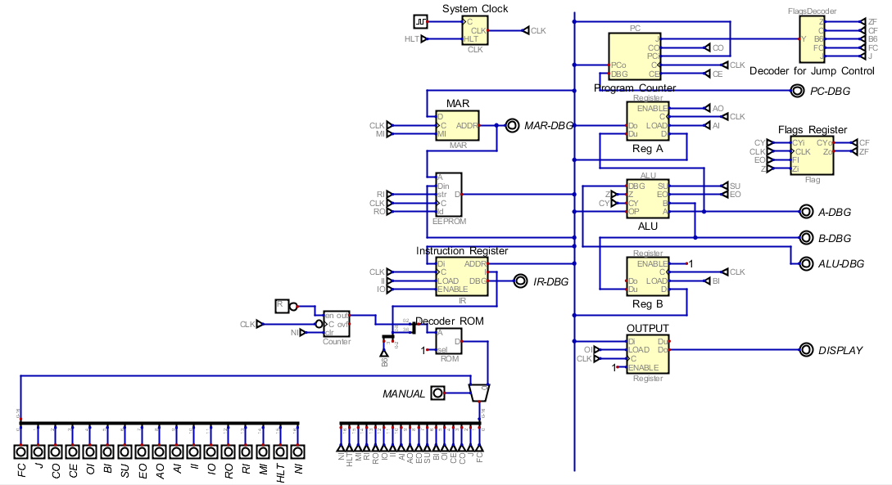
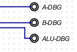
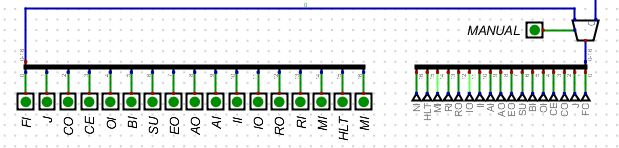

# 8-Bit Computer On Breadboard
Design and implement your own CPU and computer using basic digital building blocks on a digital circuit simulator. We implement the CPU as per Ben Eater's popular video series on the topic: [View Series](https://www.youtube.com/watch?v=HyznrdDSSGM&list=PLowKtXNTBypGqImE405J2565dvjafglHU)

# Background
During the COVID-19 lockdown, I was looking for good electronics project to pass time. A friend sent me a link to Ben Eater's video series (link above) which immediately appealed to me. He implemented the CPU on a set of breadboards with basic digital ICs. However, due to the COVID-19 lockdown, I was not able to procure the components required to implement it physically. I therefore implemented it on a digital simulator. 

The CPU can access only 16 bytes of RAM. However, it implements micro-instructions with decoding logic for the micro-instructions stored in a decoder ROM. The simplicity of the implementation make it a great learning tool.

Since Ben has an extensive 44 video playlist that explains all the core concepts and design, no additional documentation is offered here. Please acquire a basic understanding from that playlist. I made two changes to Ben's design that are listed below.

# Design Changes
In the original design, each instruction takes 8 clock cycles to execute even if it does not need all those cycles. I added a NI (Next Instruction flag) to eliminate unnecessary/"dead" clock cycles.

I also changed the decoding logic for flags used to implement the Jump instructions.

# Tools
The project is implemented using a free (but excellent!) Digital Logic Designer and Simulator: https://github.com/hneemann/Digital. The tool comes with good documentation and a host of example circuits.
Hint: It might be easier to view the schematics in this tool if you set "Show Grid" to Off under "Edit" --> "Settings"

# Implementation
The computer is implemented using basic digital building blocks:
- Logic Gates
- Registers
- Buffers
- Counters
- Adders
- Comparators
- Multiplexers

The main schematic is [CPU.dig](src/CPU.dig) in the src folder.

To aid understanding, and to map as closely as possible to Ben's physical implementation, the implementation is divided in to functional blocks:
- Clock (CLK.dig)
- Memory Access Register (MAR.dig)
- Instruction Register (IR.dig)
- Program Counter (PC.dig)
- General Purpose Register (Reg.dig)
- ALU (ALU.dig)
- Flags Decoder (FlagsDecoder.dig)
- Helper Circuit for ALU (Flag.dig)

These blocks show up in light yellow colour on the circuit. Each Input and Output of each block/component is described in detail. Right-click a block and click "Open Circuit" to view details and further right-click any input/output of the block to view the detailed description.

You can step through one clock pulse at a time to fully understand what is going on. In addition, outputs labeled "**-DGB**" are provided to observe the data at various parts of the circuit.

A complete manual override is provided, with all internal signals available.

If you switch to **Manual** switch, you can set any signal using the switchboard and redirect the operation of the CPU

## Instruction Format and implementation
The 8-bit instructions are divided in to 2 parts. The lower 4 bits (LSN = Least Significant Nibble) contain the memory address for instructions that reference memory and the higher 4 bits (MSN = Most Significant Nibble) contain the code of the instruction to be executed.

An instruction can take up to 8 cycles to execute. These instruction cycles are counted by a 3 bit counter.

The 4 bits of the MSN and the 3 bits of the counter together form the 7 bit micro-code/instruction. The internal signals/flags that are needed to implement the micro-code are stored in the Decoder ROM and these signals/flags are read from the Decoder ROM by using the 7 bits of the micro-code as its address bits.

The complete deoding logic is desceibed in the [Decoding Logic Excel](assets/DecodingLogic.xlsx). The formulas in the Excel sheet will give further insights and you can use it to make changes and implement your own instructions.

## Instruction Set
Instruction | MSN (hex) | Explanation
----------- | --------- | -----------
FETCH | 0x0 |Fetch next instruction from memory pointed by Program Counter. The first 2 steps of any instruction is a FETCH and this instruction never needs to be used explicitly, except as a NOP instruction
LDA M | 0x1 | Fetch data pointed to by Memory Access Register (MAR) and put it in Register A
ADD M | 0x2 | Fetch data pointed to by Memory Access Register (MAR) and add it to data in Register A. The result is stored in Register A
SUB M | 0x3 | Fetch data pointed to by Memory Access Register (MAR) and subtract it from data in Register A. The result is stored in Register A
STA M | 0x4 | Store current contents of Register A at memory location pointed to by Memory Access Register (MAR)
LDI A | 0x5 | _Immediate load_ Load data byte following this instruction in to Register A
JMP | 0x6 | Jump (transfer control) to instruction at memory address indicated in lower 4 bits of the JMP instruction.
JC | 0x7 | If the Carry flag is set, Jump (transfer control) to instruction at memory address indicated in lower 4 bits of the JMP instruction
JZ | 0x8 | If the Zero flag is set, Jump (transfer control) to instruction at memory address indicated in lower 4 bits of the JMP instruction
OUT | 0xE | Write contents of Register A to the Output Resgiter
HLT | 0xF | Stop Operation

Note that we can have 16 instructions but only 11 have been implemented. You can experiment and add your own instructions.

## Internal Signals/Flags
Signal/Flag | Explanation
----------- | -----------
FC | Flag Check - Instruction needs to consider state of Carry / Zero flags
 J | Jump
CO | Counter Out - Put Program Counter (PC) on the system bus
CE | Counter Enable - Increment Program Counter by 1
OI | Ouput Register In - Output Resgiter sets its state by reading from the system bus
BI | Register B In - Register B sets its state by reading from system busO
SU | Subtract - ALU operation will be subtract instead of Add
EO | Σ (sum) Out - Output of ALU operation is put on system bus
AO | Register A Out - content of Register A put on system bus
AI | Register A In - Register A sets its state by reading from system bus
II | Instruction Register In - Instruction Register sets its state by reading from system bus
IO | Instruction Register Out - LSN of instruction put on system but. HSN of instruction used to address Decoder ROM
RO | RAM Out - Contents of memory addressed by MAR (Memory Address Register) are put on system bus
RI | RAM In - Contents of system bus writen to RAM at memory addressed by MAR (Memory Address Register)
MI | Memory Address Register In - Set MAR from system bus. Only LSN is used
HLT | Halt. Stops the system clock.
NI | Next Instruction. Resets the micro-instruction step counter. Effectively ends current instruction
B6 | Most significant bit of the 7 bit micro-instruction

## Programming
As you can imagine, no Assembler or Compiler exists for the CPU. We need to translate our instructions in to machine code ourselves and enter it in to RAM (implemented via EEPROM. Edit the contents as required). Given that the RAM size is just 16 bytes, thats not a lot of effort.

The following program is baked in to the EEPROM. It counts up and output values from 0 to 255 and then back down to 0 in an infinite loop. 

Memory Address | Instruction | Hex Value | Description
-------------- | ----------- | --------- | -----------
0 | OUT | 0xE0 | Output current value of Register A
1 | ADD 0xF | 0x2F | Add contents of memory location 15 (0xF) to Register A
2 | JC 0x4 | 0x74 | Jump to memory location 4 if carry flag set
3 | JMP 0x0 | 0x60 | Jump to memory location 0
4 | SUB 0xF | 0x3F | subtract contents of memory location 15 (0xF) from Register A
5 | OUT | 0xE0 | Output current value of Register A
6 | JZ 0x0 | 0x80 | Jump to memory location 0 if zero flag set
7 | JMP 0x4 | 0x64 | Jump to memory location 4
15 | | 0x1 | Constant 1 stored at loction 15 (0xF)
